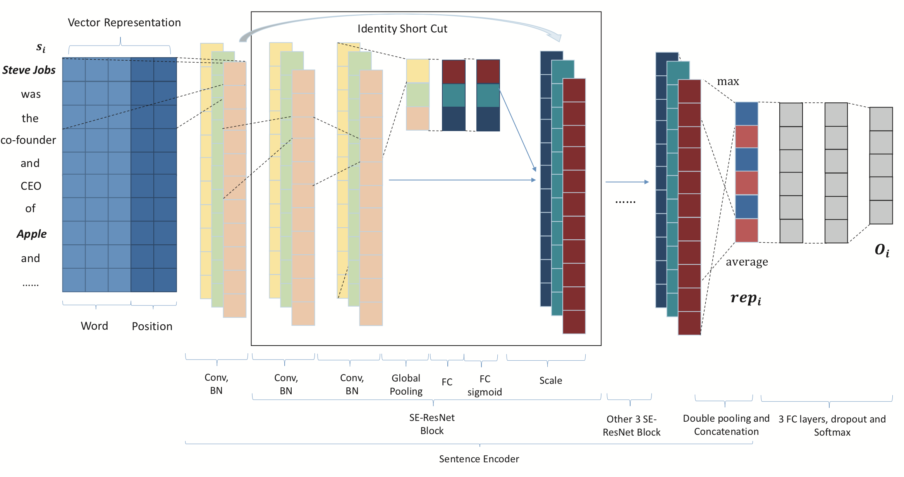
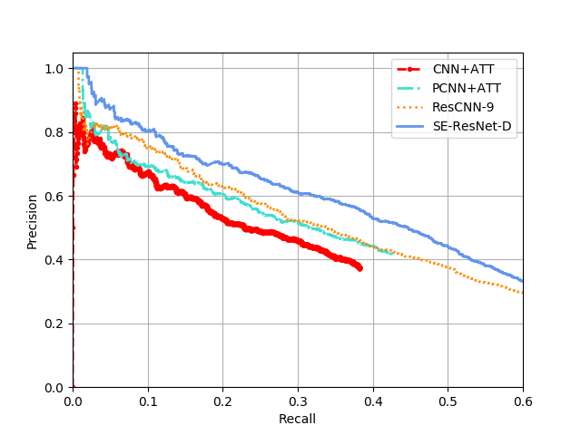

This is the implementation of my paper: SENet for Weakly-Supervised Relation Extraction (CSAI 2018)

Click here for pdf draft: [paper_draft](https://github.com/Theodoric008/SENet-for-Weakly-Supervised-Relation-Extraction/blob/master/paper_draft.pdf)

Accepted link: []() // todo

## How to train?
1. unzip zipfile in data/ (the dataset is too large that you'd better download from here: https://github.com/darrenyaoyao/ResCNN_RelationExtraction/tree/master/data )
2. in cmd:
```bash
python3 train.py
```

and test result will be saved to temp/ in format of pkl file


## How to eval?
```bash
python3 eval.py
```
## How to plot and compare with other models?
you need to fill in the pkl file path in plot script, and run
```bash
cd plot/
python3 plot_compare_with_other_model.py
python3 metric.py
```
## Model structure


## Best result(epoch ~= 170)


## Prerequisits
1. Tensorflow-gpu==1.4.0
2. sklearn, tflearn, nltk, numpy
3. Python3

## Other models for RE and some helpful repos
[PCNN + ATT](https://github.com/thunlp/OpenNRE)

[ResCNN-9](https://github.com/darrenyaoyao/ResCNN_RelationExtraction)

[Linguistic_adversity](https://github.com/lrank/Linguistic_adversity)
## About me 
Master candidate from PRIS, BUPT. 

Email: liujiashu2333@qq.com
